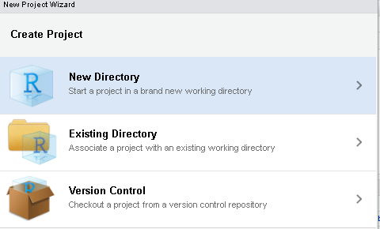
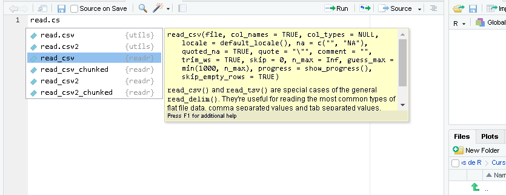

```{r include=FALSE}
options(tibble.width = NULL)
```


```{r xaringanExtra-clipboard, eval=FALSE, include=FALSE}
htmltools::tagList(
 xaringanExtra::use_clipboard(
   button_text = "<i class=\"fa fa-clipboard\"></i>",
   success_text = "<i class=\"fa fa-check\" style=\"color: #90BE6D\"></i>",
 ),
 rmarkdown::html_dependency_font_awesome()
)
```

```{r xaringan-extra-styles, echo=FALSE}
# These are the defaults
xaringanExtra::use_extra_styles(
  hover_code_line = TRUE,         #<<
  mute_unhighlighted_code = TRUE  
)
```

```{r xaringanExtra-scribble, echo=FALSE}
xaringanExtra::use_scribble()
```

```{r xaringan-panelset, echo=FALSE}
xaringanExtra::use_panelset()

xaringanExtra::style_panelset_tabs(
  active_foreground = "#0051BA",
  hover_foreground = "#d22",
  font_family = "Roboto"
)
```

<style type="text/css">
.remark-slide-content {
    font-size: 25px;
    padding: 1em 1em 1em 1em;
}
</style>


```{r, include = F}
# This is the recommended set up for flipbooks
# you might think about setting cache to TRUE as you gain practice --- building flipbooks from scratch can be time consuming
knitr::opts_chunk$set(fig.width = 10,  message = FALSE, warning = FALSE, comment = "", cache = F)


library(flipbookr)
library(tidyverse)
library(xaringanthemer)
library(xaringan)
library(gt)
library(icons)
library(kableExtra)
```


# Hoja de ruta


<br>

## ✔️ Paquetes complementarios

## ✔️ Proyectos en R

## ✔️ Lectura y escritura de archivos

<br>

Algunas referencias que inspiran este material:    

https://es.r4ds.hadley.nz/flujo-de-trabajo-proyectos.html   
https://slides.djnavarro.net/project-structure/   

---

class: inverse, center, middle

# Paquetes

<html>
  <div style='float:left'></div>
  <hr color='#EB811B' size=1px width=1125px>
</html>

---

# Paquetes  
.pull-left[
¿Qué son?, ¿para qué nos sirven?   

```{r echo=FALSE, eval=TRUE}
knitr::include_graphics("img/travolta.gif")
```
]


--
.pull-right[
✔️ Nuevas funciones, bases de datos y objetos de R en general, complementarios a lo contenido en R Base.

✔️ Aportes de Universidades, investigadores, usuaries y empresas, para expandir las capacidades del lenguaje R y facilitar su uso.  
]   

---

#Paquetes    
¿Cómo se usan?   

- Podemos descargarlos e instalarlos con el siguiente comando: 

```r
install.packages("nombre_del_paquete") 
```

- Sólo es necesario instalar el paquete una vez por computadora. Se descargarán de la pagina de [CRAN](https://cran.r-project.org) los archivos correspondientes, ubicándose en el directorio donde hayamos instalado el programa


- Una vez instalado el paquete, cada vez que abramos una nueva sesión de R y querramos utilizar el mismo debemos **cargarlo al ambiente de trabajo** mediante la siguiente función:    
```r
library(nombre_del_paquete)
```

---

class: inverse, center, middle

# Directorios de trabajo

<html>
  <div style='float:left'></div>
  <hr color='#EB811B' size=1px width=1125px>
</html>

---

#Directorios de trabajo - Proyectos
¿Cómo garantizar que la ruta para importar bases de datos al ambiente de R y para exportar resultados pueda funcionar si muevo mis carpetas o las comparto?

.left-column[
```{r echo=FALSE, eval=TRUE}
knitr::include_graphics("img/meme si y no.jpg")
```
]

.right-column[
```{r echo=TRUE, eval=FALSE}
read.csv("C:\Users\Guido\Investigación\Bases_COvid\Base Covid19.csv")
```

```{r echo=TRUE, eval=FALSE}
dir.create("C:\Users\Guido\Investigación\Resultados")
```

```{r echo=TRUE, eval=FALSE}
setwd("C:\Users\Guido\Cursos\Diplomatura UNSAM\")
```

```{r echo=FALSE, eval=TRUE,fig.align='left'}
knitr::include_graphics("img/Rproject.png")
```
]   

---
#Directorios de trabajo - Proyectos
.pull-left[Rstudio tiene una herramienta muy útil de trabajo, que son los  **proyectos**. Un proyecto es un archivo que identifica toda una carpeta de trabajo. Para crearlo, vamos al logo de nuevo proyecto y elegimos la carpeta de trabajo. Cuando trabajemos con proyectos: 

-   El directorio de trabajo siempre toma como punto inicial la carpeta donde esta ubicada el archivo .Rproj. 
-   El Environment es específico de nuestro proyecto. No se nos mezclará con resultados de código que podamos correr en otros proyectos.
]
.pull-right[
```{r echo=FALSE, warning=TRUE}
knitr::include_graphics("img/nuevo_proyecto.png")
```
```{r echo=FALSE, warning=TRUE}

```
]

---
#Práctica  

- Abran RStudio en sus computadoras y creen un nuevo proyecto en un nuevo directorio de sus computadoras.     

- Abran un nuevo script, importen las librerías **"openxlsx"** y **"tidyverse"** al ambiente de trabajo. Instalenlas previamente en caso de no haberlo hecho aún. Recuerden: `install.packages("nombre_del_paquete")`

- Guarden el script dentro de la carpeta del proyecto que crearon.   

- Ejecuten la función `list.files()`     

---

class: inverse, center, middle

# Nombrando archivos

<html>
  <div style='float:left'></div>
  <hr color='#EB811B' size=1px width=1125px>
</html>

---

#Nombrando Archivos 

##Serie de recomendaciones para organizar la carpeta de trabajo de un proyecto 
- Preferentemente utilizar minúsculas para nombrar nuestros archivos 

✅  procesamiento.r  
❌  Procesamiento.r   
✅  analisis.r   

- No utilizar espacios en blanco ni caracteres especiales (^.*?+|$) 

✅  procesamiento_base_covid.r  
❌  procesamiento base covid.r  
❌  procesamiento.base.covid.r  
✅  graficos_evolucion_covid.r  
❌  gráficos_evolución_covid.r  

---
#Nombrando archivos (y/o carpetas)
  
  - Guardar consistencia en los caracteres utilizados y el orden de los componentes de los nombres

✅  procesamiento_base_covid.r   
✅  graficos_evolucion_covid.r  
❌  covid-19-informe.rmd  

- Si tengo muchos archivos en una carpeta: utilizar números para ordenar y palabras clave para documentos similares  

✅  01_procesamiento_base_covid.r  
✅  02_graficos_evolucion_covid.r  
✅  03_graficos_provincias_covid.r  
✅  04_informe_covid.r  
❌  COVID_datos-VF20210414.r  


---


class: inverse, center, middle

# Importación y Exportación de archivos

<html>
  <div style='float:left'></div>
    <hr color='#EB811B' size=1px width=1125px>
      </html>
      
---
#Importación de bases de datos
A la hora de importar una base de datos nos podemos llegar a enfrentar a distintos tipos de archivos. En R contamos con **distintos paquetes y funciones** según el **tipo de extensión** del archivo:    

```{r echo=FALSE}
importacion <- tibble(
  "Tipo de archivo" = c("Texto Plano",
                        "Texto Plano",
                        "Texto Plano",
                        "Extension de R",
                        "Extension de R",
                         "Otros Softwares",
                         "Otros Softwares",
                         "Excel",
                         "Excel"),
           "Paquete" =c("readr",
                        "readr",
                        "readr",
                        "RBase",
                        "RBase",
                        "haven",
                        "haven",
                        "openxlsx",
                        "readxl"),
             "Extension" =c(".csv",
                          ".txt",
                          ".tsv",
                          ".RDS",
                          ".RDATA",
                          ".dta",
                          ".sav",
                          ".xlsx",
                          ".xls"),
         "Funciones" = c("read_csv()",
                           "read_txt()","read_tsv()",
                           "readRDS()", "open()",
                           "read_dta()","read_spss()",
                           "read.xlsx()","read_excel()")    
)  

kable(importacion, format = 'html') %>%
  kable_styling(bootstrap_options = c("striped", "hover")) %>% 
  collapse_rows(columns = 2)
```


---
#Importación de bases de datos

## Archivos de texto plano
.pull-left[
En archivos de texto plano, el paquete se recomienda usar el paquete **readr** (que forma parte de tidyverse). Las diferencias entre cada una de sus funciones está en los parámetros que poseen para mejorar la importación.

```{r echo=FALSE, warning=TRUE}

```
]
.pull-right[
¿Qué es lo que indican algunos de los parámetros que tenemos en la imagen?

-   encabezado (¿Tiene o no una primera fila con los nombes de las variables?)
-   delimitador (¿Cómo están separadas las variables en el archivo?: Ej: `,`, `;`, tab)
-   separador decimal (¿Cómo figuran los números en la base? Ej: ¿10.000, 10000 o 10,000)
-   quotes: ¿Como están indicados los valores de las variables de texto en la base?, ¿Aparecen entre comillas?
]

---
#Práctica

- Copien la carpeta "Bases adicionales" adentro de la carpeta del proyecto que crearon previamente.

- Con el proyecto y script previos abiertos en RStudio, importen correctamente a su ambiente de trabajo el archivo **"Covid19VacunasAgrupadas.csv"**

- Utilicen la función `read.xlsx` para importar como dos objetos separados las bases que se encuentran en ambas pestañas del excel **"Adquisiciones y vuelos covid.xlsx"**. (Pista: Pueden inspeccionar los parámetros de la función ejecutando **`?read.xlsx`**