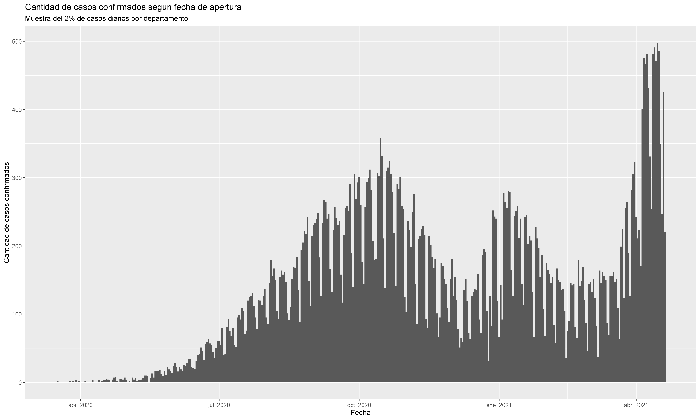

```{r setup, message = FALSE,echo=FALSE}
knitr::opts_chunk$set(echo = TRUE,include = TRUE,message = FALSE)

```



## Cargamos librerias
```{r message=FALSE, warning=FALSE}
library(tidyverse)
library(lubridate)
```

## Cargamos las bases
En esta clase trabajaremos en paralelo con dos bases de datos. Una muestra de la base argentina de casos de Covid19 y una base con tweets que mencionan la palabra "vacuna". Ambas bases cuentan con variables de tipo fecha. Aun cuando ambas permitan tratamientos similares, veremos que la clase de variable en cuestión no es idéntica en una y otra base ^[Esta clase está inspirada en el capítulo 16 del libro [R for Data Science](https://es.r4ds.hadley.nz/fechas-y-horas.html). Allí pueden profundizar algunos aspectos que exceden los alcances de la misma].     

- En la ```base.covid```, trabajaremos con la variable **fecha_apertura**, la cual nos indica la fecha en la cual fue "abierto" el caso. Es decir, el momento a partir del cual se empieza a tomar registro de una persona que fue analizada por ser posible caso positivo de COVID.  
- En la base ```vacuna.tweets```, trabajaremos con la variable **created_at** que nos indica cuando fue envíado cada uno de los tweets que constituyen los registros de la base   


```{r message=FALSE, warning=FALSE}
base.covid <- readRDS("../Fuentes/base_covid_sample.RDS")
vacuna.tweets <- readRDS("../Fuentes/Bases adicionales/vacuna.tweets.RDS")
```


```{r eval=FALSE, message=FALSE, warning=FALSE, include=FALSE}
covid.confirmado <- base.covid %>% 
  filter(clasificacion_resumen == "Confirmado")

a <- ggplot(covid.confirmado,aes(x = fecha_apertura))+
  labs(title = "Cantidad de casos confirmados segun fecha de apertura",
       subtitle = "Muestra del 2% de casos diarios por departamento",
       x = "Fecha",
       y = "Cantidad de casos confirmados")+
geom_histogram(binwidth = 1)

ggsave(a,filename = "img/casos_confirmados.png",width = 15,height = 9)
```


Veamos que rango de tiempo abarcan nuestros registros en la base de datos del covid
```{r}
range(base.covid$fecha_apertura)
```
¿Qué tipo de variable es **fecha_apertura** en la ```base.covid```??
```{r}
class(base.covid$fecha_apertura)
```
Es un tipo de variable de tiempo. Tenemos tres tipos de variables de tiempo principales en R:     

- Date: (Sólo Año, Mes y Día).   
- Time: (Un horario, sin especificar de que día es)  
- Date-time: (Año, Mes, Día y horario)    

Pasemos a la base `vacuna.tweets`. ¿Qué rango de tiempo tenemos acá?
```{r}
range(vacuna.tweets$created_at)
```

¿Qué tipo de variable es **created_at** en la base ```vacuna.tweets```?
```{r}
class(vacuna.tweets$created_at)
```
Es un tipo de variable de tiempo completa (del estilo Date-Time) que está expresada en la zona horaria [UTC](https://time.is/UTC)). 

>¿Cual creen que es la principal ventaja de contar con una fecha expresada de esta forma?      

   
##Lubridate  

El paquete `lubridate` es hoy en día uno de los más utilizados para trabajar con fechas en R. Tiene un conjunto de funciones con nombres intuitivos que permiten entre otras cosas:    

- Construir variables de tipo fecha a partir de números o caracteres    
- Extraer información de variables ya constituídas como fechas   
- Realizar operatorias con fechas (ej: calculo de distancias temporales entre dos registros)    
### ¿Y ahora?      
¿En qué momento del tiempo estoy parado según R? (En este caso es el momento en que retoqué por última vez este material)
```{r}
today()
now()
```
¿Cuántos días me quedan hasta el comienzo de la diplomatura?
```{r}
"2021-05-04"- today() 
```
Aunque R nos muestre como resultado de la función `today()` algo similar a un objeto de tipo character, no podemos simplemente a través de un character hacerle entender a R que estamos refiriendo a una fecha.     
Necesitamos explicitamente crear objetos de clase fecha!   

### Crear Fechas
Hay un set de funciones del paquete *lubridate que* siguen la siguiente lógica:          
Mediante la combinacion de los caracteres **dmy_hms** que representan a día(d), mes(m), año(y), hora(h), minuto(m) y segundo(s) podemos convertir un número (o un string) hacia una fecha.   

Por ejemplo, la función `ymd()` me permite pasar un numero que contenga año, mes y dia y transformarlo en formato fecha.
```{r}
#Distintas variantes que admite la función
ymd(20210504)  
ymd("20210504")
ymd("2021/05/04")
```
¿Cuántos días me quedan hasta el comienzo de la diplomatura?
```{r}
ymd(20210504) - today()
```
Veamos algún otro ejemplo de creación de fechas con un ordenamiento distinto de día mes y año; y con el agregado de horas, segundos y minutos.
```{r}
ejemplo2 <- "20/05/2020 18:20:40"
class(ejemplo2)
```

```{r}
ejemplo2_ok<- dmy_hms(ejemplo2)
ejemplo2_ok
class(ejemplo2_ok)
```


Para formatos un poco menos estandarizados, la función `parse_date_time()` nos puede ser útil para transformar una variable character hacia una variable fecha.
```{r}
vector_importado_excel <- c("Apr-20","May-20","Jun-20") 
parse_date_time(vector_importado_excel, orders = 'my')
```

###Extraccion de informacion de la fecha      
Otra aplicación útil de *lubridate* es que nos permite extraer muy intuitivamente información cuando contamos con una variable construida como fecha.     

```{r,warning=FALSE}
base.covid.fechas<- base.covid %>% 
  mutate(anio = year(fecha_apertura),
         semestre  = semester(fecha_apertura),
         trimestre = quarter(fecha_apertura),
         mes       = month(fecha_apertura),
         mes.nombre = month(fecha_apertura,label = TRUE),
         dia.del.mes       = mday(fecha_apertura),
         dia.del.anio      = yday(fecha_apertura),
         semana       = week(fecha_apertura),
         dia.numero= wday(fecha_apertura),
         dia.nombre= wday(fecha_apertura, label = TRUE),
         hora = hour(fecha_apertura),
         minutos = minute(fecha_apertura))


```

Veamos como quedan algunas de estas nuevas columnas.
```{r echo=FALSE}
base.covid.fechas %>% 
  select(fecha_apertura,anio,mes,dia.del.mes,dia.del.anio,dia.nombre,hora)
```
>¿Qué pasa con las horas cuando trabajamos con variables "Date"?    

###Operaciones con fechas                 

El paquete tiene una serie de funciones para operar realizando transformaciones sobre las fechas. Tomemos una fecha del primer registro para operar sobre ella: 
```{r}
fecha <- base.covid$fecha_apertura[3]
fecha
```
Probemos algunas operaciones sencillas...
```{r}
fecha+ days(2) # Le sumo dos días a la fecha
fecha+ months(1) + days(7)  # Le sumo un mes y una semana a la fecha
```
Importante tener en cuenta que tipo de resultado buscamos. **No todos los meses tienen la misma cantidad de días**. ¿Queremos construir el mismo día del mes siguiente, o queremos ver por ejemplo la evolución de un dato 30 días después? 
```{r}
fecha+ months(1) 
fecha+ days(30) 

```


Importante notar que:         

- Los nombres de funciones para **extraer** informacion de las fechas llevan el **singular** (ej: day,month,hour)
- Las nombres de funciones para **transformar** las fechas llevan el **plural** (ej: days, months,hours).   

> Practica: Filtrar un conjunto de 5 semanas consecutivas en la base de datos. ¿Qué dia de la semana se abren menos casos?      

```{r eval=FALSE, warning=FALSE, include=FALSE}
ejercicio <- base.covid.fechas %>% 
  filter(anio == 2021, semana %in%  4:8)

ejercicio %>% 
  group_by(semana,dia.nombre) %>% 
  summarise(cantidad = n())
```

Una operación  frecuente para las variables de fecha es tomar distancias entre ellas. Por ejemplo, ¿cuanto tiempo pasa entre el inicio de los sintomas y la apertura del caso en cada paciente?
```{r}
base.covid.fechas <-  base.covid.fechas %>% 
mutate(tiempo.diagnostico = fecha_diagnostico - fecha_inicio_sintomas)  

class(base.covid.fechas$tiempo.diagnostico)
```

Una resta de fechas provoca en este caso un objeto "difftime". Podemos ver ahora por ejemplo cuánto es el promedio de tiempo por provincia 
```{r message=FALSE, warning=FALSE}
base.covid.fechas %>% 
  group_by(residencia_provincia_nombre) %>% 
  summarise(tiempo.promedio = mean(tiempo.diagnostico,na.rm = T)) %>% 
  arrange(tiempo.promedio)
```

